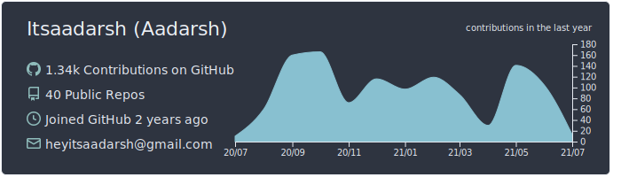

  <h1 align="center"><b>Hello there, It's <a href="http://itsaadarsh.github.io/">Aadarsh</a> here! 👋</b></h1>

  <h2 align="center"><b>Full-Stack Developer</b></h2>

 

 
- I'm a Student at VIT
- I’m currently working on many things.
- I’m currently Mastering Modern Full Stack Web Development.
- I’m looking to collaborate with other Developers.
- Ask me about anything, I am happy to help.

 

### Languages:

### Tools:

 
 
 
 

  <h1 align="center"><b>:zap: Github Stats :zap:</b></h1>

